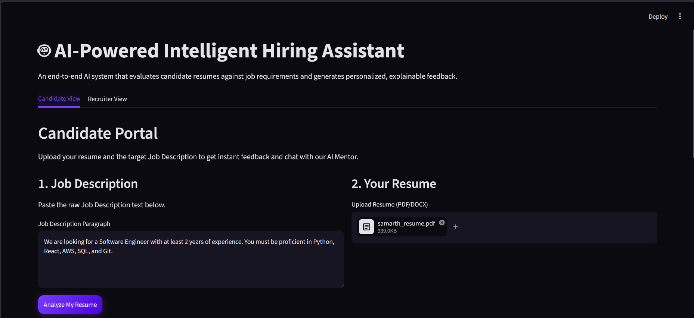
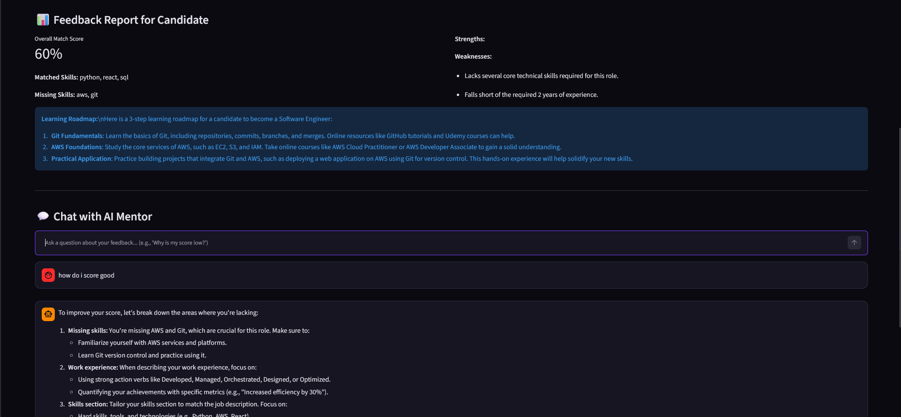
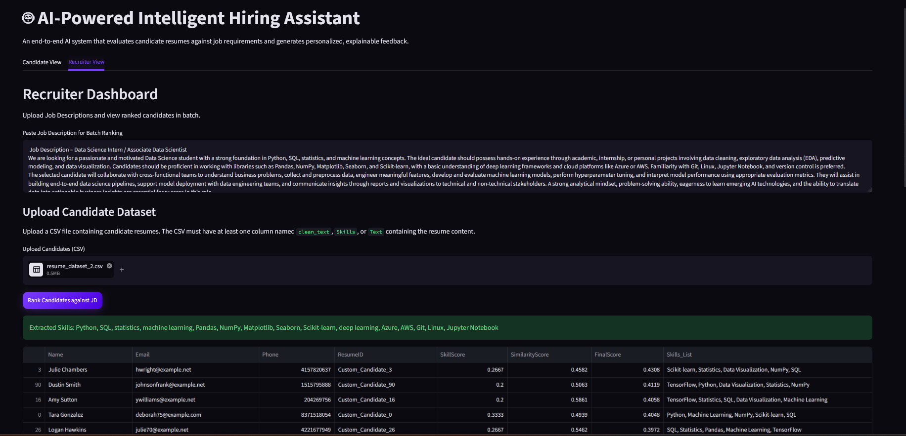
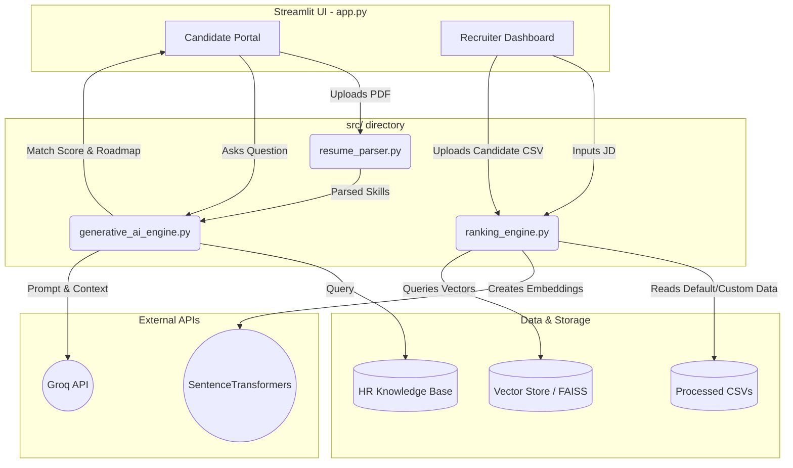

# AI-Powered Intelligent Hiring Assistant

An end-to-end AI system that evaluates candidate resumes against job requirements using machine learning and deep learning models, and generates personalized, explainable feedback through a retrieval-based intelligent text generation pipeline. 

## Demo Screenshots

| Candidate Portal (Part 1) | Candidate Portal (Part 2) | Recruiter Dashboard |
|:---:|:---:|:---:|
|  |  |  |


## Documentation & Features

The project is organized into 5 core modules:

1. **Data Engineering & Preprocessing:** Handles data ingestion, EDA, feature engineering, and robust train-test splitting.
2. **Machine Learning Classification:** Training of Discriminative models (XGBoost, Random Forest) via TF-IDF to predict 40+ job categories.
3. **Semantic Resume Parsing & Ranking:** Real-time extraction of applicant data (PDF/DOCX via PyMuPDF/spaCy) and dynamic ranking against Job Descriptions using prioritized Skill Matching (50%), Semantic Similarity (30%), and Contextual weights.
4. **Generative AI & Conversational Mentorship:** Leverages the Groq API for Explainable AI (XAI) feedback, builds an HR Knowledge Base via a FAISS-backed RAG Pipeline, and deploys a conversational Chatbot to act as a career mentor.
5. **Full-Stack Application (Streamlit):** Unifies all components into a seamless web interface with dark-mode optimizations.

## Dataset Provenance

**All machine learning models, testing pipelines, and candidate rankings are trained and evaluated on a single source of truth: `resumes_dataset.jsonl` (3,501 records).** 
The resulting CSVs (`train.csv`, `test.csv`, `resumes_eda_pass.csv` found in `data/processed/`) are exclusively generated and derived from this initial JSONL file through our automated Data Engineering module, ensuring strict data integrity.


## Architecture Diagram



## Evaluation Report

Our classification engine evaluated multiple models. The **XGBoost Classifier** achieved the highest performance across all 41 job categories.

### XGBoost Metrics (Overall)
- **Accuracy:** 92%
- **Macro Avg (Precision/Recall/F1):** 95% / 95% / 95%
- **Weighted Avg (Precision/Recall/F1):** 93% / 92% / 92%

*Example Category Performance:*
| Category | Precision | Recall | F1-Score |
|---|---|---|---|
| AI Engineer | 1.00 | 1.00 | 1.00 |
| Data Science | 0.90 | 0.95 | 0.92 |
| Software Developer | 1.00 | 1.00 | 1.00 |
| React Developer | 0.63 | 0.60 | 0.62 |

*(Full detailed report available in `reports/2_ML_Classification/classification_report.md`)*

## Setup Instructions

1. **Clone the Repository** and navigate to the project root:
   ```bash
   git clone https://github.com/yourusername/AI-Hiring-Assistant.git
   cd AI-Hiring-Assistant
   ```
2. **Install Dependencies:**
   ```bash
   pip install -r requirements.txt
   ```
3. **Set Environment Variables:**
   You must set your `GROQ_API_KEY`. 
   * **Why is this needed?** The API key is required to power the Generative AI features, including generating personalized candidate feedback, extracting skills from raw Job Descriptions, and running the interactive HR Chatbot.
   ```bash
   # Windows (PowerShell)
   $env:GROQ_API_KEY="your-api-key-here"
   
   # Mac/Linux
   export GROQ_API_KEY="your-api-key-here"
   ```
4. **Train Models & Generate Vector Store (Optional if pre-trained):**
   ```bash
   python preprocess_and_train.py
   ```
5. **Run the Application:**
   ```bash
   streamlit run app.py
   ```
