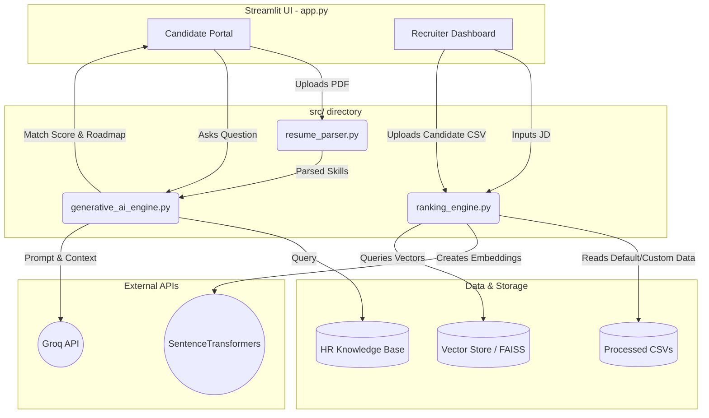
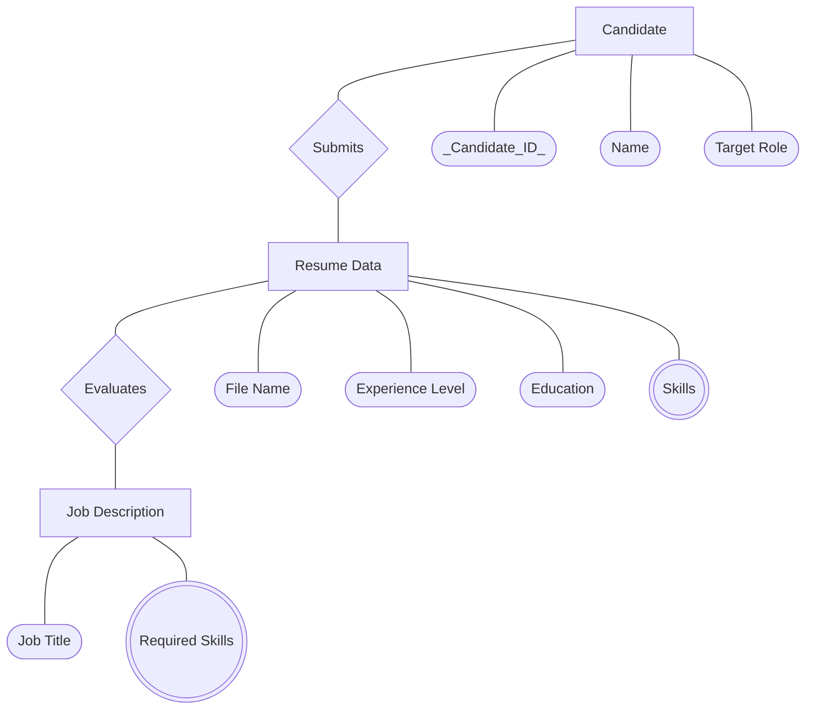
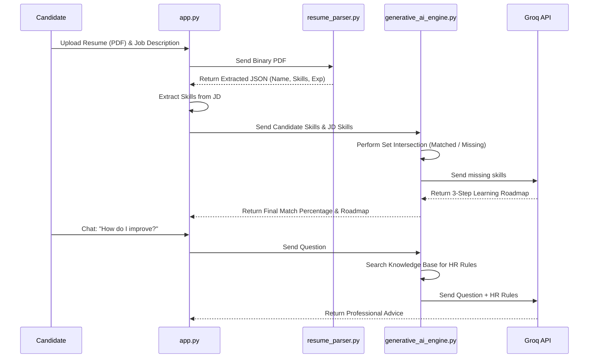
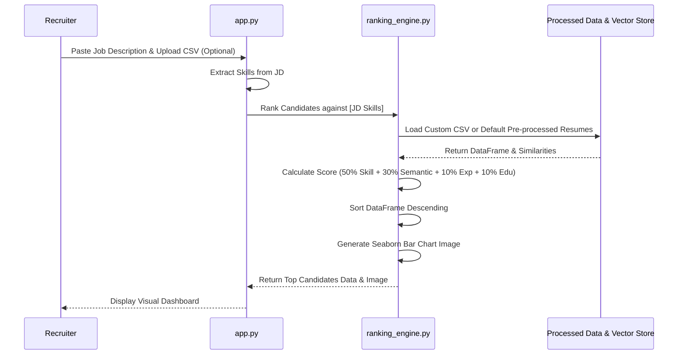

# The Ultimate AI Hiring Assistant Master Guide

This is the complete, definitive technical manual for your AI Hiring Assistant. It explains the exact folder structure, how every single file connects to one another, and provides visual diagrams for the entire data flow.

---

## 1. The 5-Module Folder Structure

The project is strictly organized into 5 core modules. Here is the entire tree map of how files are structured:

```text
AI-Hiring-Assistant/
│
├── 📄 app.py                           <-- Main Entry Point (The Streamlit Application)
├── 📄 preprocess_and_train.py          <-- The Backend Data Pipeline (Runs once to prep data)
│
├── 📁 src/                             <-- Core Logic Modules (Imported by app.py)
│   ├── 📄 resume_parser.py             (Extracts text & skills from PDFs)
│   ├── 📄 ranking_engine.py            (Semantic matching & mathematical ranking for candidates)
│   ├── 📄 generative_ai_engine.py      (Explainable AI & RAG Pipeline for chatbot and mentorship)
│   └── 📄 train_models.py              (XGBoost / Random Forest Training Scripts)
│
├── 📁 data/
│   ├── 📁 raw/                         <-- Raw input data (e.g., resumes_dataset.jsonl)
│   └── 📁 processed/                   <-- train.csv, test.csv, resumes_eda_pass.csv
│
├── 📁 models/                          <-- Saved AI Models (.pkl files)
│   ├── best_model.pkl                  (Trained Classifier)
│   ├── label_encoder.pkl               
│   ├── tfidf_vectorizer.pkl
│   ├── scaler.pkl
│   ├── feature_metadata.json
│   └── embedding_model_info.json
│
├── 📁 vector_store/                    
│   ├── 📁 faiss_index/                 <-- FAISS index for fast similarity search
│   ├── st_resume_embeddings.pkl        <-- Precomputed semantic embeddings
│   └── st_resume_ids.pkl               
│
├── 📁 knowledge_base/
│   └── hr_guidelines.json              <-- The Local HR Knowledge Base for the Chatbot
│
└── 📁 reports/                         <-- Auto-generated analytics and charts
    ├── 1_Data_Engineering/
    ├── 2_ML_Classification/
    ├── 3_Semantic_Ranking/
    ├── 4_GenAI_Mentorship/
    └── 5_Streamlit_App/
```

---

## 2. Overall System Architecture Diagram

This diagram shows how the frontend (Streamlit) interacts with our custom `src/` modules, and how those modules talk to the Data and the Groq API.



---

## 3. Entity-Relationship (ER) Diagram (Data Flow)

Here is the ER diagram showing how data entities like Candidates, Resumes, and Job Descriptions interact with each other in the database.



---

## 4. File Dependency Map (How the files are connected)

If you look at the `import` statements at the top of the files, here is exactly how they rely on each other:

1. **`app.py` is the boss.** It imports almost everything from the `src/` folder:
   - `from src.generative_ai_engine import GenerativeAIEngine`
   - `from src.ranking_engine import CandidateRanker`
   - `from src.resume_parser import parse_resume`
2. **`preprocess_and_train.py` is the data factory.** It runs independently before the app starts. It cleans the raw data in `data/raw` and imports `src.train_models.py` to immediately build the XGBoost model and save it to the `models/` folder.
3. **`ranking_engine.py` is self-contained.** It handles both the semantic similarity matching (using SentenceTransformers) and the final scoring, outputting results directly to the Streamlit UI.

---

## 5. Candidate Flow Diagram (Step-by-Step)

Here is the exact journey of a Candidate using the portal:



---

## 6. Recruiter Flow Diagram (Step-by-Step)

Here is the exact journey of a Recruiter ranking thousands of resumes at once:



---

## 7. Detailed File Breakdown

Here is exactly what every single file is responsible for:

### The Brains
- **`app.py`:** The Streamlit user interface. It contains the layout, the CSS styling, the buttons, and acts as the traffic cop directing data to the right `src/` modules.
- **`preprocess_and_train.py`:** A one-time setup script. You run this to ingest the raw data from `data/raw`, clean it, calculate word counts, and train the Machine Learning models.

### The `src/` Modules
- **`resume_parser.py`:** The text extractor. It uses libraries like `PyMuPDF` to read PDFs, and `spaCy` to recognize human names in the text.
- **`train_models.py`:** The math classroom. It tests Logistic Regression, Random Forest, SVM, and XGBoost against the resumes to see which model is best at guessing a candidate's job category.
- **`ranking_engine.py`:** The judge and deep thinker. It uses `SentenceTransformers` (`all-MiniLM-L6-v2`) to perform semantic matching and then multiplies all the scores together, generating final bar charts using `matplotlib` and `seaborn`.
- **`generative_ai_engine.py`:** The teacher and librarian combined. It manages Explainable AI (XAI) to find missing skills and uses a RAG pipeline (Retrieval-Augmented Generation) connected to a local HR knowledge base to answer user questions contextually via Groq.
